# My music taste: A data analysis
## Description of the problem
The field of my research is music. I wanted to anaylze my music taste with the help of datamining. I want to see if it is possible to isolate distinctive features in the genres and artists I gravitate towards. The main goal of this project is to:
* get better insight into my music taste
* find trends and patterns in my listening habits
* discover how diverse (or homogenous) my taste is
* learn which musical properties influence my liking of a song
* draw a comparison with another user
## Data
I have chosen to scrape the data from my Spotify account. Scraping was done using the Spotify Web API and Spotipy. Spotipy is a Python library that makes it easier to access different end points in the API. Spotify was a clear choice because they collect vast amounts of metadata for music, as well as a lot of information on their users. The end result of my web scraping is the library.csv dataset. 

In addition to scraping information from my personal library, I also collected data from a random user. I searched for a playlist of a similar size that contains another person's music library and collected the same attributes. This is the randomuser.csv dataset.
### Data attributes

Both the library.csv dataset and randomuser.csv consist of track metadata and Spotify's audio features for each of the songs.

Attribute | Description      | Type | Value
----------|------------------|------|------
Id      | Spotify track ID. | String | Discrete
Title | Title of the track. | String | Discrete
All_artists | All artists featured on the track. | String | Discrete
Popularity | Spotify's popularity rating. It's based on number of plays and how recent they are. | Numeric | Discrete
Release_date | Year when the track was first released. | String | Discrete
Danceability | Danceability describes how suitable a track is for dancing based on a combination of elements such as tempo, rhythm stability, beat strength. | Numeric | Continuous
Energy | Energy is a measure that represent intensity and activity. | Numeric | Continuous
Key | The key the track is in. | Numeric | Discrete
Loudness | The loudness of a track in decibels (dB). | Numeric | Continuous
Mode | Detects the modal quality of a track, if the song uses major or minor scale. | Numeric | Discrete
Acousticness | Detects whether the track is acoustic. | Numeric | Continuous
Instrumentalness | Predicts whether a track contains no vocals. | Numeric | Continuous
Liveness | Detects live recordings. | Numeric | Continuous
Valence | A measure describing the musical positiveness conveyed by a track. | Numeric | Continuous
Tempo | The overall tempo of a track in beats per minute (BPM). | Numeric | Continuous
Duration_ms | Duration of the song in miliseconds. | Numeric | Discrete
Time_signature | The time signature notes how many beats are in each measure of a piece of music. | Numeric | Discrete

### Spotify Audio Features

Spotify calculates and collects a variety of different audio features for each track. They represent different aspects of a song like mood, technical properties and context. This is the basis of how their algorithm recommends new songs to users and creates personalized playlists.  The attribute descriptions were taken from Spotify Developer guide.

- Acousticness: A confidence measure from 0.0 to 1.0 of whether the track is acoustic. 1.0 represents high confidence the track is acoustic.
    

- Danceability: Danceability describes how suitable a track is for dancing based on a combination of musical elements including tempo, rhythm stability, beat strength, and overall regularity. A value of 0.0 is least danceable and 1.0 is most danceable.
    

- Energy: Energy is a measure from 0.0 to 1.0 and represents a perceptual measure of intensity and activity. Typically, energetic tracks feel fast, loud, and noisy. For example, death metal has high energy, while a Bach prelude scores low on the scale. Perceptual features contributing to this attribute include dynamic range, perceived loudness, timbre, onset rate, and general entropy.
    

- Instrumentalness: Predicts whether a track contains no vocals. "Ooh" and "aah" sounds are treated as instrumental in this context. Rap or spoken word tracks are clearly "vocal". The closer the instrumentalness value is to 1.0, the greater likelihood the track contains no vocal content. Values above 0.5 are intended to represent instrumental tracks, but confidence is higher as the value approaches 1.0.
     
     
- Key: The key the track is in. Integers map to pitches using standard Pitch Class notation. E.g. 0 = C, 1 = C♯/D♭, 2 = D, and so on. If no key was detected, the value is -1.
    
    
- Liveness: Detects the presence of an audience in the recording. Higher liveness values represent an increased probability that the track was performed live. A value above 0.8 provides strong likelihood that the track is live.
    
    
- Loudness: The overall loudness of a track in decibels (dB). Loudness values are averaged across the entire track and are useful for comparing relative loudness of tracks. Loudness is the quality of a sound that is the primary psychological correlate of physical strength (amplitude). Values typically range between -60 and 0 db.

- Mode: Mode indicates the modality (major or minor) of a track, the type of scale from which its melodic content is derived. Major is represented by 1 and minor is 0.
    
    
- Tempo: The overall estimated tempo of a track in beats per minute (BPM). In musical terminology, tempo is the speed or pace of a given piece and derives directly from the average beat duration

- Time signature: An estimated time signature. The time signature (meter) is a notational convention to specify how many beats are in each bar (or measure). The time signature ranges from 3 to 7 indicating time signatures of "3/4", to "7/4".
    

- Valence: A measure from 0.0 to 1.0 describing the musical positiveness conveyed by a track. Tracks with high valence sound more positive (e.g. happy, cheerful, euphoric), while tracks with low valence sound more negative (e.g. sad, depressed, angry).

## Preprocessing and first look at data

Before I performed any analysis on the data, I did a few preprocessing steps. First I made sure the dataframes don't contain any NaN values and removed unwanted columns. Then I normalized the data by rescaling the values of tempo and loudness using min-max scaler. This was done so that all of the continuous audio feature values reside in the same range between 0 and 1. 

### Distribution of songs and artists
The dataset which contains my library is library.csv. It contains a total of 2268 tracks from 199 artists. The top five artists with the most songs in the dataset are: 

Artist | # of songs
----------|----------
The Cure | 111
Lady Gaga | 100
My Chemical Romance | 99
The Used | 69
Bauhaus | 66

Below is a more detailed look into the most common artists you can find in my playlist:

The top three alone contain more than 300 songs between them. It is easy to see I favor certain artists over others. 31% of songs come from just 10 artists. The rest of the artists contribute with  40 or less tracks. There are also many artists who are represented with just 1 or 2 songs. However, there is one factor I didn't take into account - the overall number of songs one artists has in their discography. So while this graph illustrates my likes it doesn't accurately portray how much I like an individual artist.

This histogram shows all 199 artists and the number of songs they have in the playlist. Each bar is one artist. Now it's easy to see how much more some artists are found than others.

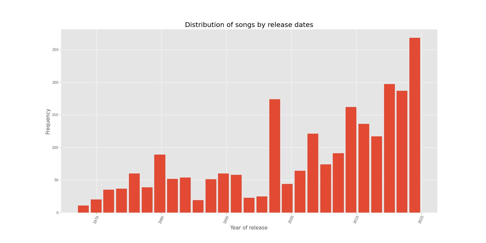
Most tracks in the dataset that represents my music library were released the last two decades. The year 1998 stands out as an outlier in this trend. There is also a minor spike in early 80s. The data is left-skewed. Overall, we can see I preffer modern artists and gravitate towards recently recorded music. 

### Distribution of songs and artists for random user
The other dataset that I am using in this analysis belongs to a random Spotify user. I thought that comparing my music data with somebody elses could provide me with further insight. I selected this playlist because it contains another user's full library and has a similar number of tracks. I performed all of the same preprocessing steps on this dataset as I did for the previous one.

The dataset containing a random user's library has 2189 tracks from 703 artists. Just from the number of songs and artists it could be possible to conclude the other person has a more diverse music taste than I do. My library contains just below 200 artists while theirs has over 700. 

The top twenty most frequently found artists in their library are:

Similarly to my own dataset, this user has some clear favorites too, with Bruce Springsteen taking up 6.81% of their library.

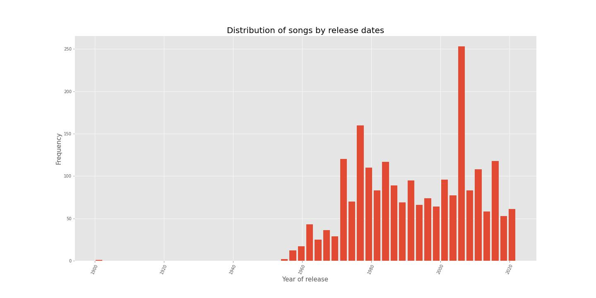

The songs are more evenly distributed over time in the other dataset. We could hypothesize about the reasons for this kind of distibution. The user might be older or simply prefer older musical acts.

## Analysis
I started the analysis by plotting a histogram of the Spotify audio features.

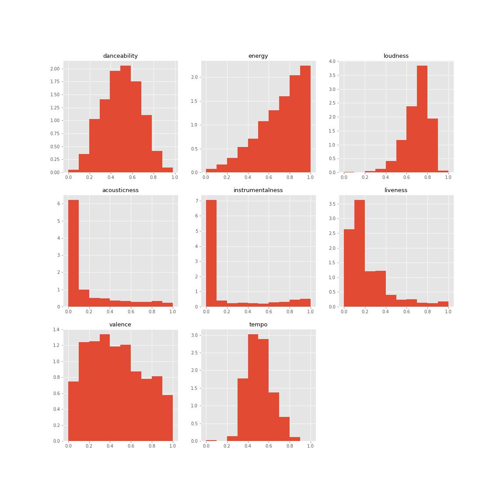 

Here we can see the distribution audio features across the data. Danceability most closely resembles normal distribution out of them all. Most songs are moderately danceable, while very slow and very fast songs are rarer. The histogram for energy is negatively skewed and shows there are more songs with moderate to high energy. Fairly loud songs are more represented in my library than quiet ones, which correlates positively with energy.

Measures for acousticness and instrumentalness are low, meaning that there aren't many purely acoustic or instrumental tracks in my library. Next feature shows there are some possible instances of live recordings. Valence is a feature the mood of a track, how 'happy' a song sounds. Overall, it looks like the data skews slightly towards sadder, low mood songs. Tempo is moderate, and most songs lie between the values of 0.4 and 0.6

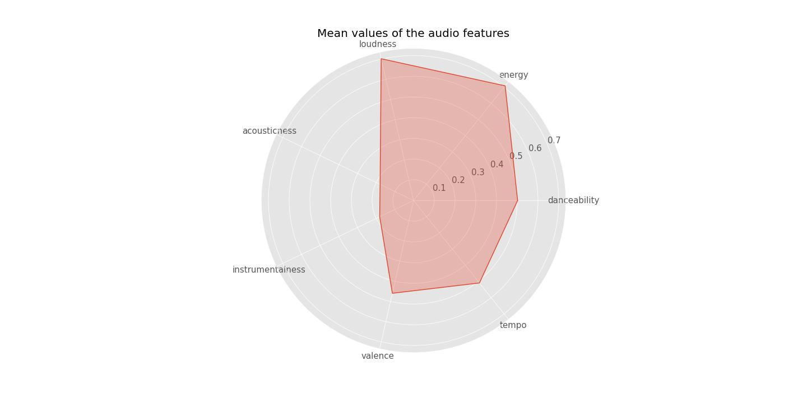 

This radar chart represents the mean values of audio features. The prevalent attributes amongst artists in my library are loudness and energy. The frequency of both features could be explained by my liking of rock and pop music. Despite high loudness and energy, valence isn't that common of an attribute. Most songs have low to moderate score. A possible explanation is the prevalence of bands like My Chemical Romance and The Misfits in the data set - high energy songs with negative, sad or angry moods. 

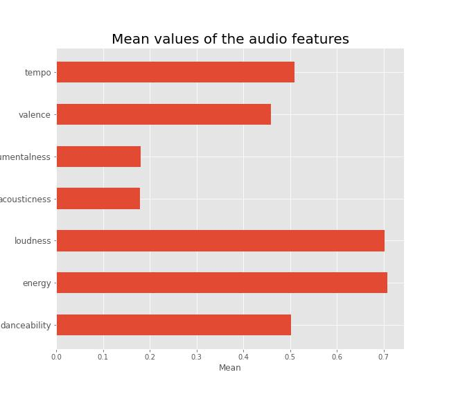 

Mean values of audio features represented in a standard bar plot.

Here I wanted to more closely examine how different audio features correlate to one another. Below we can see a pair plot showing the relationship between pairs of audio features found in my data set.

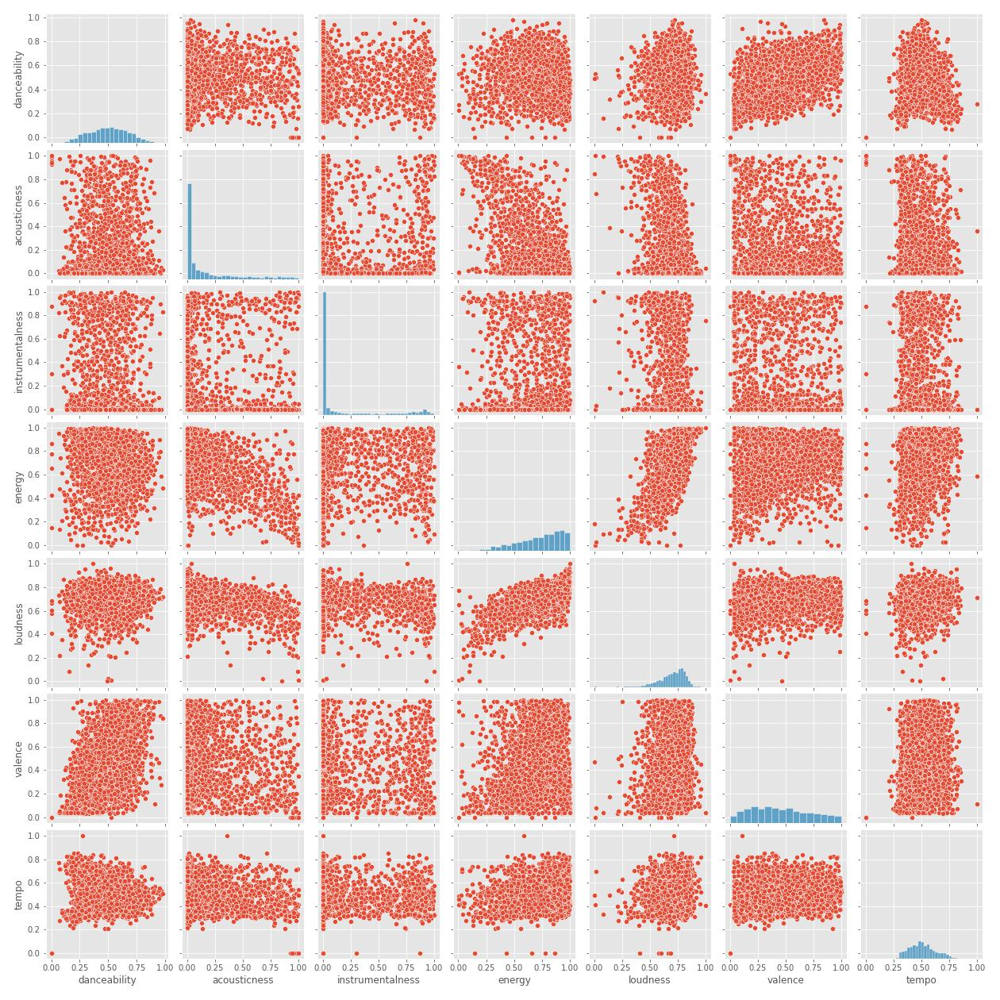 

Most of the features actually don't have a very strong relationship between them. There also seem to be plenty of outliers in a few of the plots. Due to the number of features and tracks the data is a bit hard to read. A heatmap gives us clearer insight.

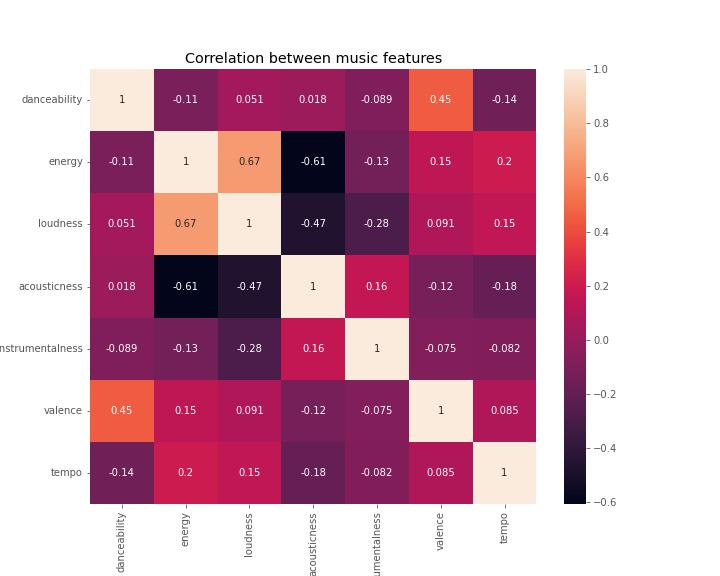

Now it's a lot easier to see how pairs of features correlate to eachother. There are clear relationships between loudness and energy, valence and danceability and acousticness and energy.

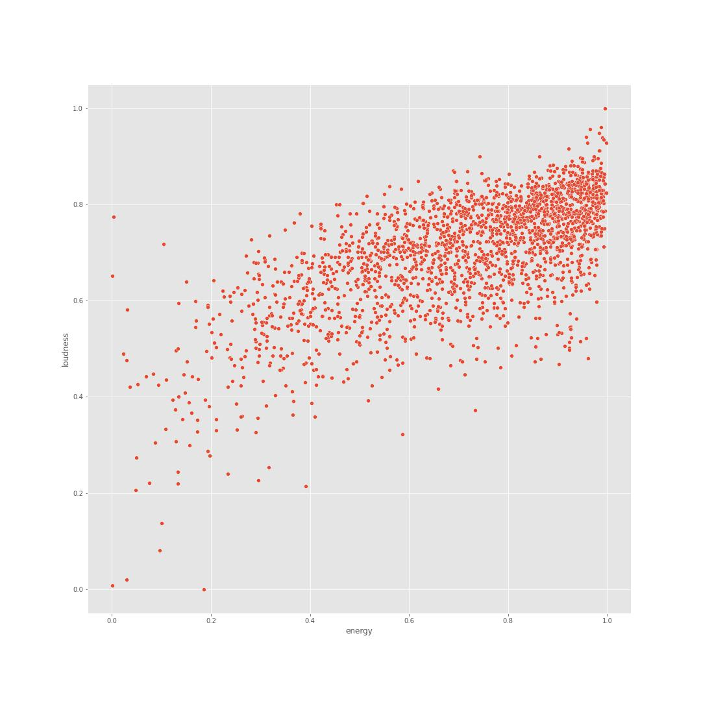

Loudness and energy are the only two features in the data set that have a strong positive correlation. It seems that tracks with high values for loudness also have high energy. From this, one could conclude my data set contains mostly loud, energetic songs which is true as mentioned before. It would be easy to extrapolate the artists in my library are more likely to produce songs in genres like rock, punk and pop as opposed to blues, jazz or reggae for example.

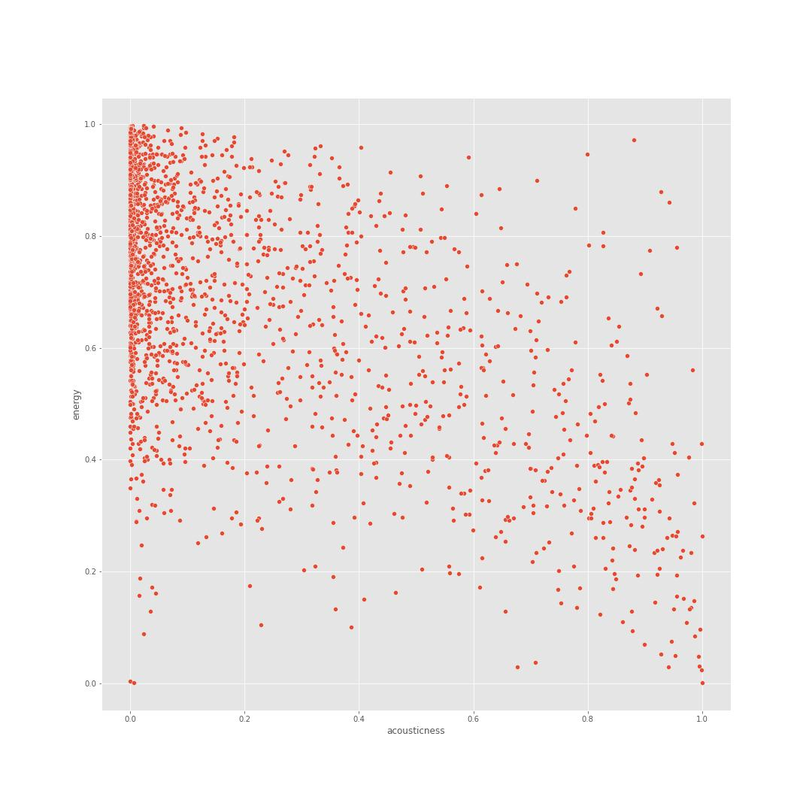 

Energy and acousticness have a strong negative correlation. In my data set, there isn't a large amount of purely acoustic tracks and we can see that I prefer songs with high energy which are not likely to be acoustic.

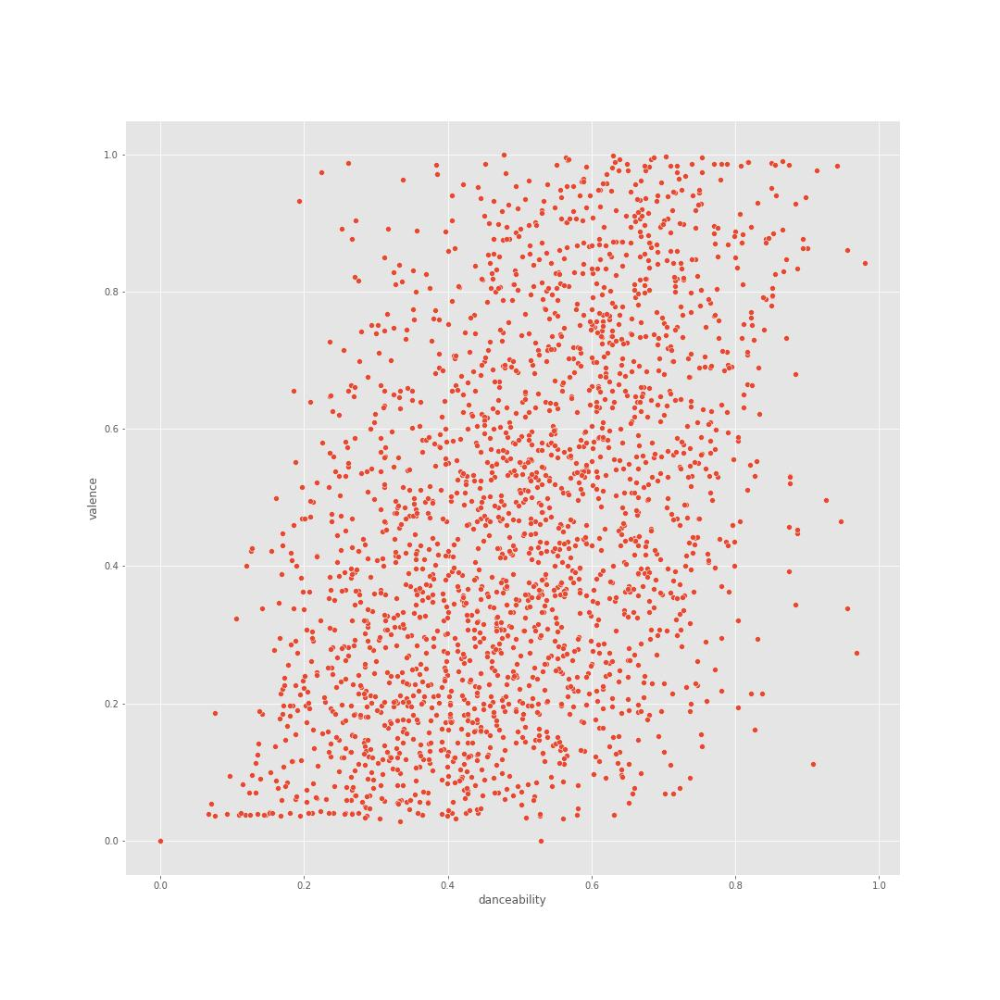 

Valence and danceability have a slightly positive relationship, however there also seem to be some outliers. This means that the data includes some tracks which have a negative mood but are highly danceable and vice versa. Sad but danceable songs can be found in some subgenres of goth, emo and rock which I do listen to frequently. This is consistent with my previous observations and with the most frequent artists featured in the dataset.

## Comparison

First, I wanted to take a look at popularity scores and how the compare. 

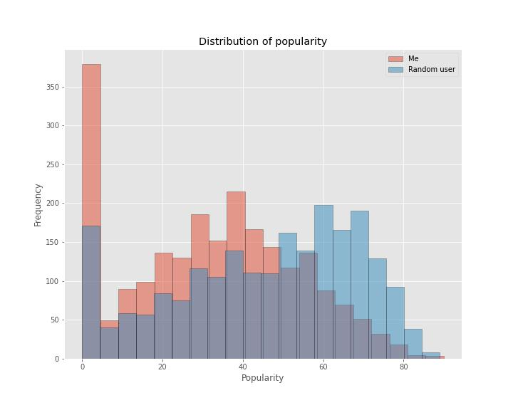

The distribution of popularity is more irregular in the data set representing my music library, with most of the tracks having a very low popularity score. The number of tracks drops of the higher the score is. The other set includes music that is moderately to highly popular although the frequency of songs also decreases with popularity. Neither of us seem to listen to many very popular songs, but comparatively my taste seems to be a bit more niche.

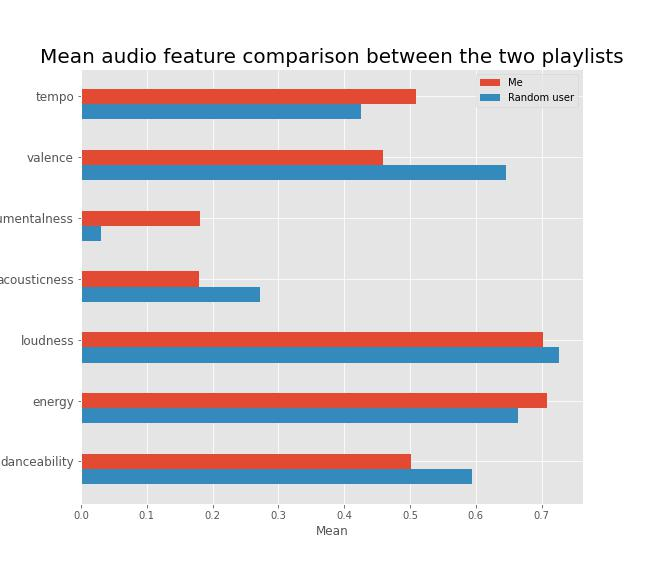

The plot shows how the mean values of audio features compare between the two data sets. This users top audio features are valence, loudness and energy. My library contains songs that are sadder, more instrumental and more energetic while the random user seems to enjoy happier, louder songs with a lower measure of BPM.

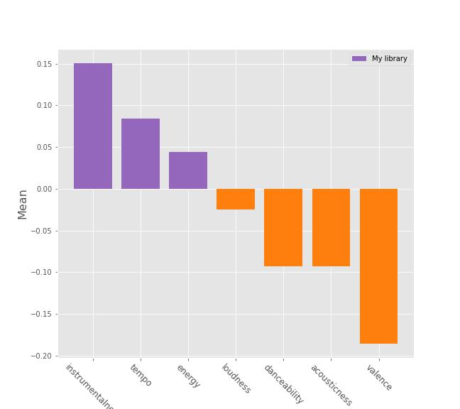

This next plot shows the difference between mean values for each audio feature. The biggest difference is found in instrumentalness and valence, while our loudness values are the most similar. 

In order to see how varied the two data sets are in terms of audio features, I decided to use standard deviation. I computed the mean of standard deviation values for each of the music attributes.

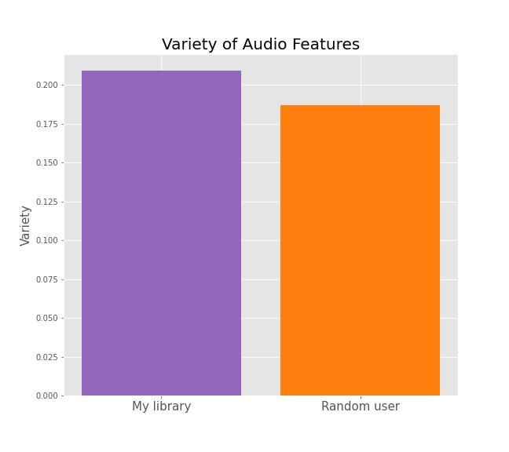

STD mean of audio features from my library 0.21
STD mean of audio features from a random library 0.19

The results could indicate that the features found in my data set are more diverse than the audio attributes found in the data set for the random user, but only slightly. From this, we could conclude that my music taste is more diverse in comparison, however it could also just mean that some tracks simply have much higher values of specific features which skews the results.

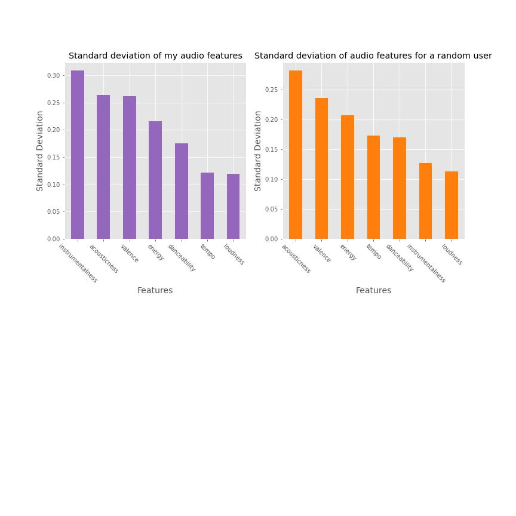
