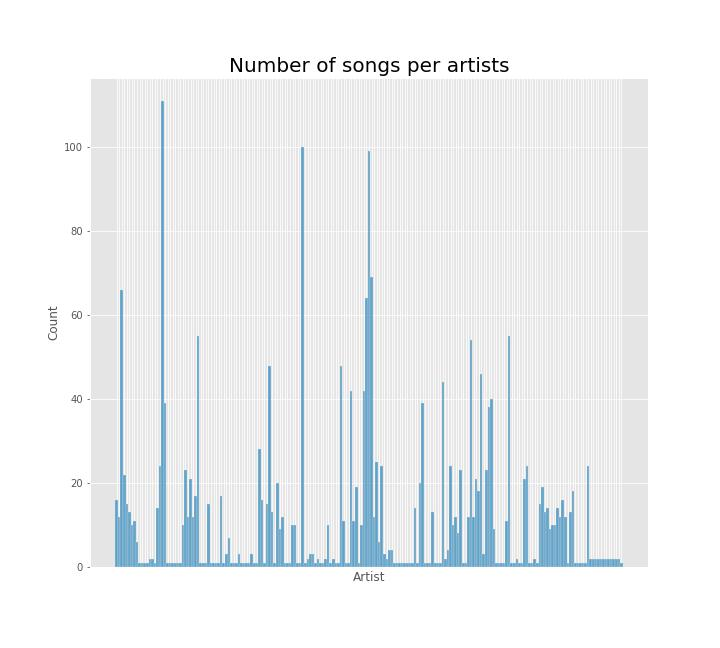
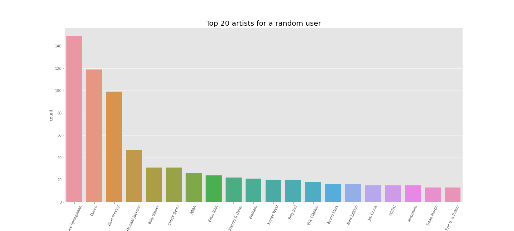

# My music taste: A data analysis
## Description of the problem
The field of my research is music. I wanted to anaylze my music taste with the help of datamining. I want to see if it is possible to isolate distinctive features in the genres and artists I gravitate towards. The main goal of this project is to:
* get better insight into my music taste
* find trends and patterns in my listening habits
* discover how diverse (or homogenous) my taste is
* learn which musical properties influence my liking of a song
* draw a comparison with another user
## Data
I have chosen to scrape the data from my Spotify account. Scraping was done using the Spotify Web API and Spotipy. Spotipy is a Python library that makes it easier to access different end points in the API. Spotify was a clear choice because they collect vast amounts of metadata for music, as well as a lot of information on their users. The end result of my web scraping is the library.csv dataset. 

In addition to scraping information from my personal library, I also collected data from a random user. I searched for a playlist of a similar size that contains another person's music library and collected the same attributes. This is the randomuser.csv dataset.
### Data attributes

Both the library.csv dataset and randomuser.csv consist of track metadata and Spotify's audio features for each of the songs.

Attribute | Description      | Type | Value
----------|------------------|------|------
Id      | Spotify track ID. | String | Discrete
Title | Title of the track. | String | Discrete
All_artists | All artists featured on the track. | String | Discrete
Popularity | Spotify's popularity rating. It's based on number of plays and how recent they are. | Numeric | Discrete
Release_date | Year when the track was first released. | String | Discrete
Danceability | Danceability describes how suitable a track is for dancing based on a combination of elements such as tempo, rhythm stability, beat strength. | Numeric | Continuous
Energy | Energy is a measure that represent intensity and activity. | Numeric | Continuous
Key | The key the track is in. | Numeric | Discrete
Loudness | The loudness of a track in decibels (dB). | Numeric | Continuous
Mode | Detects the modal quality of a track, if the song uses major or minor scale. | Numeric | Discrete
Acousticness | Detects whether the track is acoustic. | Numeric | Continuous
Instrumentalness | Predicts whether a track contains no vocals. | Numeric | Continuous
Liveness | Detects live recordings. | Numeric | Continuous
Valence | A measure describing the musical positiveness conveyed by a track. | Numeric | Continuous
Tempo | The overall tempo of a track in beats per minute (BPM). | Numeric | Continuous
Duration_ms | Duration of the song in miliseconds. | Numeric | Discrete
Time_signature | The time signature notes how many beats are in each measure of a piece of music. | Numeric | Discrete

### Spotify Audio Features

Spotify calculates and collects a variety of different audio features for each track. They represent different aspects of a song like mood, technical properties and context. This is the basis of how their algorithm recommends new songs to users and creates personalized playlists.  The attribute descriptions were taken from Spotify Developer guide.

- Acousticness: A confidence measure from 0.0 to 1.0 of whether the track is acoustic. 1.0 represents high confidence the track is acoustic.
    

- Danceability: Danceability describes how suitable a track is for dancing based on a combination of musical elements including tempo, rhythm stability, beat strength, and overall regularity. A value of 0.0 is least danceable and 1.0 is most danceable.
    

- Energy: Energy is a measure from 0.0 to 1.0 and represents a perceptual measure of intensity and activity. Typically, energetic tracks feel fast, loud, and noisy. For example, death metal has high energy, while a Bach prelude scores low on the scale. Perceptual features contributing to this attribute include dynamic range, perceived loudness, timbre, onset rate, and general entropy.
    

- Instrumentalness: Predicts whether a track contains no vocals. "Ooh" and "aah" sounds are treated as instrumental in this context. Rap or spoken word tracks are clearly "vocal". The closer the instrumentalness value is to 1.0, the greater likelihood the track contains no vocal content. Values above 0.5 are intended to represent instrumental tracks, but confidence is higher as the value approaches 1.0.
     
     
- Key: The key the track is in. Integers map to pitches using standard Pitch Class notation. E.g. 0 = C, 1 = C♯/D♭, 2 = D, and so on. If no key was detected, the value is -1.
    
    
- Liveness: Detects the presence of an audience in the recording. Higher liveness values represent an increased probability that the track was performed live. A value above 0.8 provides strong likelihood that the track is live.
    
    
- Loudness: The overall loudness of a track in decibels (dB). Loudness values are averaged across the entire track and are useful for comparing relative loudness of tracks. Loudness is the quality of a sound that is the primary psychological correlate of physical strength (amplitude). Values typically range between -60 and 0 db.

- Mode: Mode indicates the modality (major or minor) of a track, the type of scale from which its melodic content is derived. Major is represented by 1 and minor is 0.
    
    
- Tempo: The overall estimated tempo of a track in beats per minute (BPM). In musical terminology, tempo is the speed or pace of a given piece and derives directly from the average beat duration

- Time signature: An estimated time signature. The time signature (meter) is a notational convention to specify how many beats are in each bar (or measure). The time signature ranges from 3 to 7 indicating time signatures of "3/4", to "7/4".
    

- Valence: A measure from 0.0 to 1.0 describing the musical positiveness conveyed by a track. Tracks with high valence sound more positive (e.g. happy, cheerful, euphoric), while tracks with low valence sound more negative (e.g. sad, depressed, angry).

## Preprocessing and first look at data

Before I performed any analysis on the data, I performed a few preprocessing steps. First I made sure the dataframes don't contain any NaN values and removed unwanted columns. Then I normalized the data by rescaling the values of tempo and loudness using min-max scaler. This was done so that all of the continuous audio feature values reside in the same range between 0 and 1. 

### Distribution of songs and artists
The dataset which contains my library is library.csv. It contains a total of 2268 tracks from 199 artists. My top twenty most represented artists are:

The top three alone contain more than 300 songs between them. It is easy to see I favor certain artists over others. 31% of songs come from just 10 artists. The rest of the artists contribute with  40 or less tracks. There are also many artists who are represented with just 1 or 2 songs. However, there is one factor I didn't take into account - the overall number of songs one artists has in their discography. So while this graph illustrates my likes it doesn't accurately portray how much I like an individual artist.

This histogram shows all 199 artists and the number of songs they have in the playlist.

### Distribution of songs and artists for random user
The same preprocessing steps were done on the dataset for the random user.

The dataset containing a random user's library has 2189 tracks from 703 artists. Just from the number of songs and artists it could be possible to conclude the other person has a more diverse music taste than I do. My library contains just below 200 artists while theirs has over 700. 

The top twenty most frequently found artists in their library are:

## Analysis

